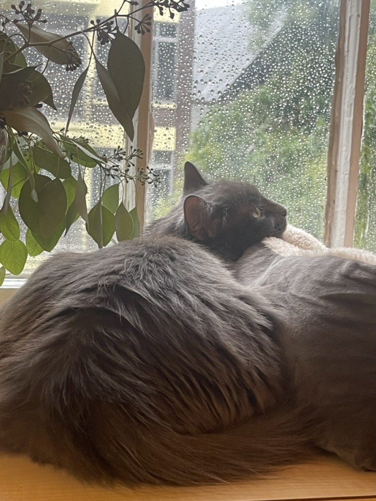

# Say HI to Smoky

Hi, This is Ada with my cat Smoky. About Page shows a more professional side of me while in this landing page, I'm just gonna say some random facts about myself.

  

>

# How to describe me 

I'm from China, with Changchun as my place of origin, yet for the past five years, I have lived in Shanghai for bachelor degree and for work. It's fascinating how I've come to develop a deep connection to both cities, despite their strikingly contrasting natures.

I'm an [INFJ](https://www.16personalities.com/infj-personality) and also a [Scorpio](https://www.zodiacsign.com/zodiac-signs/scorpio/). I don't really believe in condensing one's personality into so few catergories but still it is an easy way to learn oneself.

I'm new to the city before that I learnt NYC from the Sex and City and Friends. So glad to have this opportunity and always willing to explore. 

# Comments {.tabset}

Sry, this maily would be consisted of Mandarin

## Books
* 黄金时代 （[中] 王小波，ISBN: 9787536025080）好看极了，一读再读

* 始于极限  ([日] 上野千鹤子 / [日] 铃木凉美，ISBN: 9787513349369) 可读性高，忍不住击节赞赏，但有时双方都在回避问题，要是能更犀利就好了

* 冬牧场 ([中] 李娟，ISBN: 9787513305662) 很平淡温暖，看完感觉人很渺小，但又不虚无

* 人生海海（[中] 麦家， ISBN: 9787530219218）很烂，吹他的人不知道怎么想的，建议去看豆瓣短评以此来平复受伤的心

## Music

* 送流水，声音碎片乐队
* 泸沽湖，麻园诗人
* 米店，张玮玮/郭龙
* 殉情，夏之禹
* SongF, 达达乐队
* Stop Crying your heart out, Oasis
* Paul, Big Thief
* Unknown, Jacob Banks
* Tuesday, Five for Fighting
* You and I, Scorpions
* Splendor in the Grass, Pink Martini
* Fix You, Coldplay
* Space Oddity, David Bowie

